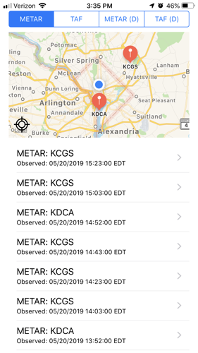
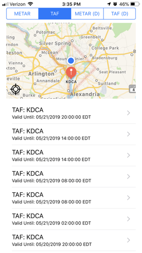
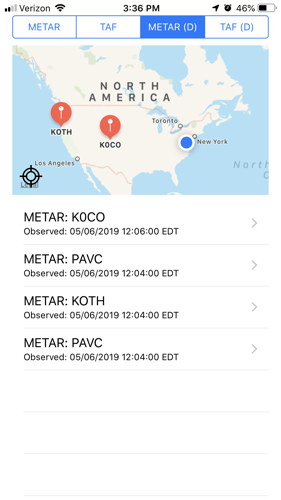
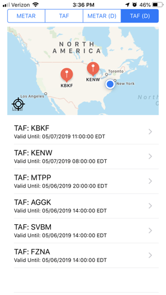

# AviationKit

[](https://travis-ci.org/mikesilvers/AviationKit)
[](https://cocoapods.org/pods/AviationKit)
[](https://cocoapods.org/pods/AviationKit)
[](https://cocoapods.org/pods/AviationKit)

## Overview
The FAA provides weather reports and additional notices on a XML based server format.  The FAA [weather server](https://www.aviationweather.gov/dataserver)   provides [METAR's](https://www.aviationweather.gov/metar), [TAF's](https://aviationweather.gov/static/help/taf-decode.php), [AIREP](https://www.aviationweather.gov/airep/help), [AIR/SIGMET's](https://aviationweather.gov/sigmet/help), [G-AIRMET's](https://aviationweather.gov/gairmet/help), and STATION INFO.

The initial release of the library contains basic METAR and TAF information based on location.  As the library grows, additional functionality and additional reports will be added.

## Example

The pod contains a fully functional example app.  To run the example project, clone the repo, and run `pod install` from the Example directory first.

## Requirements
In order to keep the library up to date, we will develop one OS level behind the current iOS version.  For example, as iOS current version is 12, we will develop this project at iOS version 11.  When iOS version 13 is released, this project will update to iOS 12 and the back level.  

## Installation

AviationKit is available through [CocoaPods](https://cocoapods.org). To install
it, simply add the following line to your Podfile:

```ruby
pod 'AviationKit'
```

## Screenshots

### METAR By Location:

 

### TAF By Location


### METAR Sample
 

### TAF Sample


## Author

Mike Silvers, mikesilvers@gmail.com

## License

AviationKit is available under the MIT license. See the LICENSE file for more info.

## Change Log
The change log contains all version updates and information.

### Version 1.0
This is the primary release and contains the following:

* [METAR](https://aviationweather.gov/dataserver):
	* The following functionality has been implemented.
		* Radial Distance: the distance (in miles) from the latitude and longitude specified.
		* Latitude & Longitude: the center point for the radial distance.
		* Data Source: The type of report to retrieve.  `metars` is the type of report we are accessing.
		* Most Recent: `true` will return only one report, the most recent report.  `false` will return all reports within the timeline indicated.
		* Hours Before Now: The number of hours prior to the request time for data.  The maximum number of hours is 3.
		* Request type: the type of request: `retrieve` used to retrieve data.
		* Data Format: indicates the type of service to be used.  The default is XML.  We only process XML in this project.
* [TAF](https://aviationweather.gov/dataserver)
	* The following functionality has been implemented.
		* Radial Distance: the distance (in miles) from the latitude and longitude specified.
		* Latitude & Longitude: the center point for the radial distance.
		* Data Source: The type of report to retrieve.  `metars` is the type of report we are accessing.
		* Most Recent: `true` will return only one report, the most recent report.  `false` will return all reports within the timeline indicated.
		* Hours Before Now: The number of hours prior to the request time for data.  The maximum number of hours is 3.
		* Request type: the type of request: `retrieve` used to retrieve data.
		* Data Format: indicates the type of service to be used.  The default is XML.  We only process XML in this project.
* Example Project.
The sample project provided displays sample METAR data and sample TAF data.  The sample project also provides a map and actively queries METAR and TAF data using the GPS from your phone.
